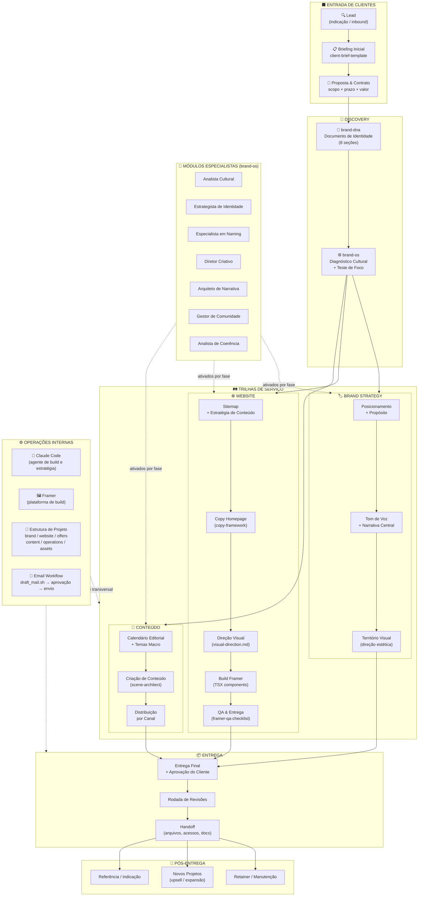

# OTMA — Company Flowchart

Visual map of the agency's structure, service tracks, and client workflow.
Built for Miro import (Mermaid diagram) or manual recreation.

---

## How to use in Miro

1. Open Miro → New board
2. Add widget → Embed → paste the Mermaid code block
3. Or use [mermaid.live](https://mermaid.live) to export as SVG/PNG → import into Miro
4. Use the **Color Guide** below to apply OTMA brand colors per zone

---

## Color Guide (for Miro manual build)

| Zone               | Fill        | Border      |
|--------------------|-------------|-------------|
| Entry / Lead       | `#F5F0EB`   | `#C4A882`   |
| Brand Track        | `#EAF0FB`   | `#4A7FD4`   |
| Website Track      | `#F0F7EE`   | `#4CAF50`   |
| Content Track      | `#FDF5E6`   | `#E8A838`   |
| Delivery / Output  | `#F9ECEC`   | `#D94F4F`   |
| Operations / Tools | `#F4F4F4`   | `#888888`   |

---

## Mermaid Diagram

---

## Narrative Summary

OTMA operates as a branding and web design agency built around a systematic,
AI-assisted methodology. Every client project passes through three phases:

1. **Entry** — Lead capture, briefing, and scoping.
2. **Discovery** — Deep brand interrogation via `brand-dna` and cultural diagnosis
   via `brand-os`. This phase produces the identity document that feeds all
   downstream work.
3. **Execution** — Three parallel service tracks activate based on project scope:
   - **Brand Strategy**: positioning, voice, visual territory
   - **Website**: sitemap → copy → design → Framer build → QA
   - **Content**: editorial calendar → production → distribution
4. **Delivery** — Unified handoff with revision rounds and full documentation.
5. **Post-delivery** — Retainer, upsell, and referral loop.

Specialist modules from `brand-os` are activated at each phase as needed —
never all at once. Internal operations (Claude, Framer, scripts) support every
track without being visible to the client.
